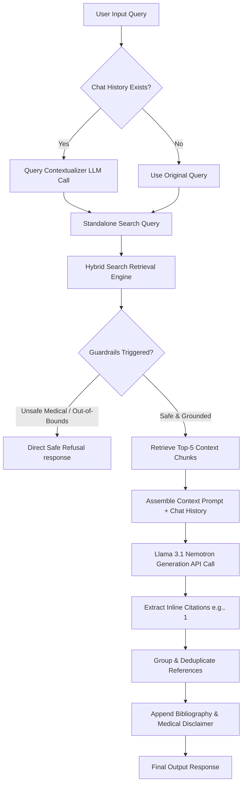

# Healthcare RAG Chatbot: Generation Pipeline Documentation

This document describes the architectural design, security controls, and logic flow of the **Generation and Retrieval-Augmented Generation (RAG) Pipeline** implemented in `generate.py`.

---

## 1. High-Level Architecture Overview

The generation pipeline is responsible for taking a user's natural language input, querying the persistent vector database, evaluating safety boundaries, and using the **Llama 3.1 Nemotron 70B Instruct** model (via NVIDIA NIM) to synthesize a grounded, cited, and safe medical/healthcare answer.



---

## 2. Component breakdown & Logic Flows

### 2.1 Multi-Turn Memory & Query Rewriting (`rewrite_query_with_history`)
When users engage in a multi-turn conversation, they frequently use relative pronouns (e.g., *"How do I apply for **it**?"* or *"What are **its** symptoms?"*). Direct keyword or semantic search on these phrases fails because they lack context.

* **Function:** `rewrite_query_with_history(user_query, chat_history)`
* **Logic:** 
  1. If `chat_history` is empty, it returns the `user_query` unmodified.
  2. If history exists, it formats the last 4 exchanges into a message prompt and sends it to Llama 3.1 Nemotron.
  3. Llama 3.1 Nemotron generates a standalone version of the query (e.g. *"Who is eligible to apply for Ayushman Bharat PM-JAY?"* instead of *"Who is eligible to apply for this scheme?"*).
  4. **Fallback:** If the API times out or fails, a `try-except` block catches the error, prints a warning, and falls back to the original `user_query` so the pipeline never crashes.

### 2.2 Guardrail Checking & Local Refusals (`query_rag_chatbot`)
Before contacting the generative model, the pipeline leverages local guardrails implemented in the retrieval layer:
* **Medical Boundaries:** Rejects queries asking for diagnostic prescriptions, dosage amounts, or medication choices to prevent unsafe clinical actions.
* **Scope Control:** Filters out queries with a high semantic distance (>0.39) to prevent general chat prompts from consuming tokens.
* If either guardrail triggers, the pipeline immediately returns the static refusal message without contacting the LLM, saving API tokens and guaranteeing safety.

### 2.3 LLM Response Generation (`generate_response`)
* **Context Formatting:** The retrieved chunks are structured with sequential indices:
  ```text
  ---
  [1] Source: WHO Fact Sheets (Diabetes)
  Content: ...
  ---
  ```
* **Prompt Engineering:** The `SYSTEM_PROMPT` enforces:
  1. **Strict Grounding:** The model is strictly prohibited from using pre-trained external knowledge. If facts are missing from the context, it must reply: *"I am sorry, but I do not have enough information to answer your query."*
  2. **Citations:** The model must reference the source chunks inline using brackets matching the chunk indexes (e.g. `[1]`).
  3. **Disclaimers:** Every condition/symptom discussion must end with the standard medical disclaimer.
* **Timeout Protection:** The call is protected by a `timeout=60.0` parameter. If the NVIDIA NIM server experiences high traffic, the request is aborted after 60 seconds instead of locking the backend process indefinitely.

### 2.4 Citation Grouping & Reference Formatting (`format_response_with_citations`)
In raw generation outputs, the LLM might cite the same source document multiple times across different chunks (e.g. citing `[1]`, `[2]`, and `[3]` for three chunks from the WHO Diabetes factsheet). Printing the same source details multiple times in the bibliography looks redundant.

* **Deduplication Logic:** 
  1. The function scans the output text for inline citation brackets `[\d+]` using regex.
  2. It groups the matching indices by the unique combination of `(source_name, title, url)`.
  3. It collects all distinct section names (e.g., "Symptoms", "Type 2 diabetes") retrieved from the chunks.
  4. It compiles a grouped bibliography entry:
     ```text
     [1, 2] Source: WHO Fact Sheets (Diabetes) - Section(s): Symptoms, Type 2 diabetes - URL: https://www.who.int/news-room/fact-sheets/detail/diabetes
     ```
  5. The disclaimer is split and re-appended at the very bottom so the bibliography sits cleanly above it.

---

## 3. Rate-Limiting & Production Considerations

* **API Throttling Protection:** Public developer NIM endpoints enforce strict rate limits. To respect these limits during automated testing, the benchmark loop pauses for **2 seconds** (`time.sleep(2)`) between consecutive RAG queries.
* **Stateless vs Stateful Session Memory:** The `query_rag_chatbot` takes `chat_history` as an optional input argument. Web servers or API frameworks (e.g., FastAPI, Flask) can manage user sessions via database models or Redis caches and pass the memory array statefully on each API call.
